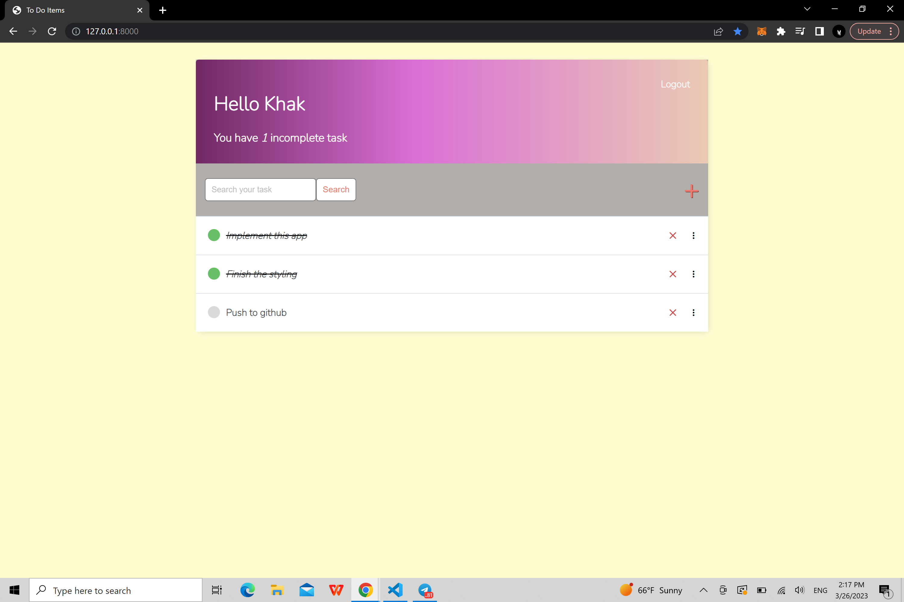

# Django Todo App

This is a simple todo app built using the Django web framework. It allows users to register, login, create, update, delete and reorder tasks.




## Installation

To run this app locally, you'll need to have Python 3 and Django installed on your machine. 

1. Clone the repository to your local machine:

```git clone https://github.com/abdulkhak/django-todo-app.git```

2. Navigate to the project directory:

```cd django-todo-app```

3. Install the dependencies:

```pip install -r requirements.txt```

4. Migrate the database:

```python manage.py migrate```

5. Create a superuser:

```python manage.py createsuperuser```

6. Start the development server:

```python manage.py runserver```

You can then access the app in your browser at [http://localhost:8000](http://localhost:8000).


## Usage
To use the app, first create an account by clicking the "Register" link on the home page. Once you've registered and logged in, you can create a new task by clicking the "plus" button. From there, you can update or delete your tasks as needed.
To reorder your tasks, simply drag and drop them into the desired order on the "Tasks" page.